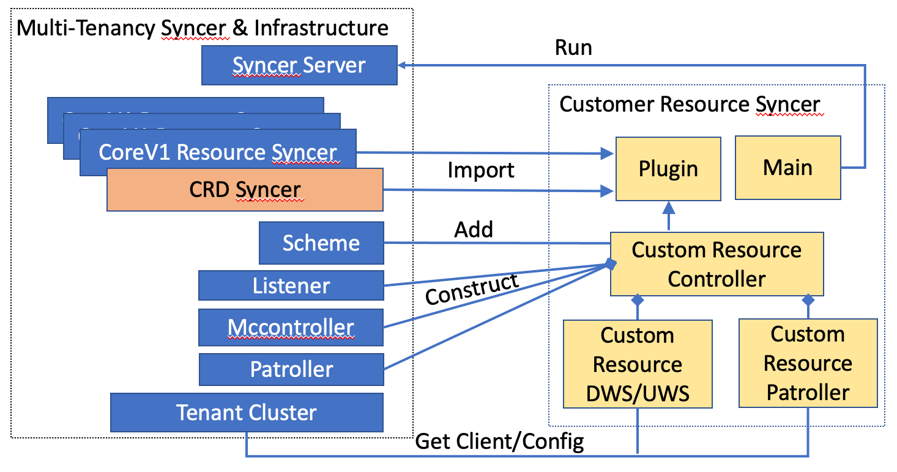

# Custom Resource Synchronization in Multi-Tenancy Virtual Cluster

## Overview

In this example we will show how to build a custom resource (CR) synchronization module (CR Syncer) to synchronize CR resources between  multi-tenancy virtual cluster and super cluster.

CR Syncer relies on CR specific components, e.g. CR controller, CR Downward Syncer (DWS)  and CR patroller, together with multi-tenancy virtual cluster infrastructures utilities: multi-tenancy/incubator/virtualcluster/pkg/util,  to fulfill  synchronization functionalities. 


## CRD Synchronization

In order for CR Syncer to work, custom defined resource type (CRD) must be deployed in both super cluster and tenant virtual cluster. CRD synchronization has been handled by: virtualcluster/pkg/syncer/resources/crd/

CRDs with annotation: [tenancy.x-k8s.io/super.public](https://sigs.k8s.io/multi-tenancy/incubator/virtualcluster/pkg/syncer/constants/constants.go#L65-L66) will be synced up into tenant’s virtual cluster. The syncing happens when virtual cluster is created or once the annotation is changed. 

CRD synchronization ensures all custom defined resource type is deployed in virtual cluster, and CRD cache is properly initialized.

### CRD Cache Remapping

Multi-tenancy virtual cluster infrastructure takes care of CRD cache and CR informer mapping dynamically. When CR syncer sets up its CR informer in virtual cluster, it is possible that CRD has not been deployed in virtual cluster. In this case, once CRD is synced to virtual cluster,  controller-runtime `NewDynamicRESTMapper` is used to dynamically map newly created CRD cache with corresponding CR informer. 

### CRD example

Following Foo CRD will be used here as an example:

```
package v1alpha1

import metav1 "k8s.io/apimachinery/pkg/apis/meta/v1"

type FooSpec struct {
        Replicas int `json:"replicas"`
}

// +k8s:deepcopy-gen:interfaces=k8s.io/apimachinery/pkg/runtime.Object
type Foo struct {
        metav1.TypeMeta   `json:",inline"`
        metav1.ObjectMeta `json:"metadata,omitempty"`
        Spec FooSpec `json:"spec"`
}

// +k8s:deepcopy-gen:interfaces=k8s.io/apimachinery/pkg/runtime.Object
type FooList struct {
        metav1.TypeMeta `json:",inline"`
        metav1.ListMeta `json:"metadata,omitempty"`
        Items []Foo `json:"items"`
}
```

## Custom Resource (CR) Syncer 

Following diagram shows CR syncer components and how they interact with multi-tendency infrastructure utilities. 

CR specific synchronization operations are handled by CR Controller, CR Downward syncer (DWS), CR Upward syncer (UWS) (optional) and CR patroller. CR syncer can also include other k8s resources synchronization functionalities by importing corresponding packages from multi-tenancy/incubator/virtualcluster/pkg/syncer/resources .  The Plugin is used to pull all these packages during compilation time.

The Main runs Syncer Server utility: multi-tenancy/incubator/virtualcluster/cmd/syncer/app/server.go, which initializes all pre-included syncer controllers and bootstraps reconciling.



### Multi-tenancy Infrastructure Utility Object Construction

CR controller is responsible for instantiating CR specific Mccontroller, Patroller and Listener from following packages:

```
 import (
        "sigs.k8s.io/multi-tenancy/incubator/virtualcluster/pkg/util/mccontroller"
        "sigs.k8s.io/multi-tenancy/incubator/virtualcluster/pkg/syncer/patrol"
        "sigs.k8s.io/multi-tenancy/incubator/virtualcluster/pkg/util/listener"
        )
```

Foo Mccontroller can be constructed as:

```
multiClusterFooController, err := mccontroller.NewMCController(&v1alpha1.Foo{}, &v1alpha1.FooList{}, c,
 mc.WithOptions(options.MCOptions))
```

Foo Protroller can be constructed as:

```
fooPatroller, err := patrol.NewPatroller(&alpha1.Project{}, c, pa.WithOptions(options.PatrolOptions))
```

Foo Listener is constructed as:

```
func (c *controller) GetListener() listener.ClusterChangeListener {
   return listener.NewMCControllerListener(c.multiClusterFooController, mc.WatchOptions{})
}
```

### CR Client Construction

Current Multi-tenancy syncer uses client-go library to build shared client and informer for all standard K8s resources. However client-go client cannot embed CR client.  CR controller needs to construct CR client using Restful config of super cluster and tenant virtual cluster.

Following code shows how to constructing CR Client and informer for super cluster:

```
import (
       "sigs.k8s.io/controller-runtime/pkg/client"
       "sigs.k8s.io/controller-runtime/pkg/cache"
       )

 
 superFooClient, err := client.New(config.RestConfig, client.Options{})
 
 superFoocache, err = cache.New(config.RestConfig, cache.Options{})
 superFooInformer, err := c.superFoocache.GetInformer(context.Background(), &alpha1.Foo{})
  
```

CR cache needs to be bootstrapped, We can put the bootstrap logic in DWS or UWS initialization function as:

```
func (c *controller) StartDWS(stopCh <-chan struct{}) error {
   go superFoocache.Start(stopCh)
}
```


For Virtual Cluster CR Client, we can either get informer from CR Mccontroller, or construct client using tenant virtual cluster Restful config.

```
 clusterInformer, err := c.multiClusterFooController.GetCluster(cluster).GetInformer(&alpha1.foo{})
 
 vcRestConfig := c.MultiClusterController.GetCluster(vclusterName).GetRestConfig()
 virtualFooClient, err := client.New(vcRestConfig, client.Options{})
```

### CR Scheme Building

Custom Resource Scheme installation happens in Init function of each CR Syncer package.  Controller runtime scheme builder is used here.

```
import (
       "k8s.io/sample-controller/pkg/apis/samplecontroller/v1alpha1" 
       "k8s.io/apimachinery/pkg/runtime"
       )

var scheme = runtime.NewScheme() 
func init() {
     v1alpha1.AddToScheme(scheme)
}
```


Foo CRD should be added into virtualcluster/pkg/syncer/util/scheme  to enable CR object conversion in Mccontroller:

```
 import (utilscheme "virtualcluster/pkg/syncer/util/scheme")
 
 utilscheme.Scheme.AddKnownTypePair(&alpha1.Foo{}, &alpha1.FooList{})
 
```

## CR Syncer Testing 

CR syncer relies on self constructed CR clients to perform synchronization between virtual and super clusters. Current testing framework in multi-tenancy/incubator/virtualcluster/pkg/syncer/util/test uses /k8s.io/client-go/ fake client to initialize resource controllers:

```
func NewFooController(config *config.SyncerConfiguration,
        client clientset.Interface,
        informer informers.SharedInformerFactory,
        vcClient vcclient.Interface,
        vcInformer vcinformers.VirtualClusterInformer,
        options manager.ResourceSyncerOptions)
```

/k8s.io/client-go client cannot be extended to embed CR client. Therefore a different NewFooController will be built to pass in CR fake client/informer instances to CR Syncer. 

